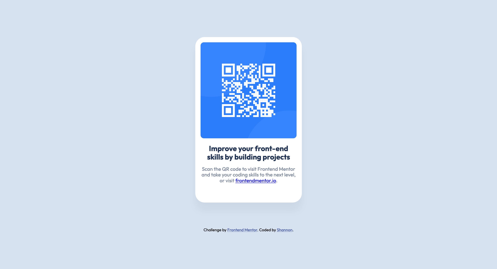
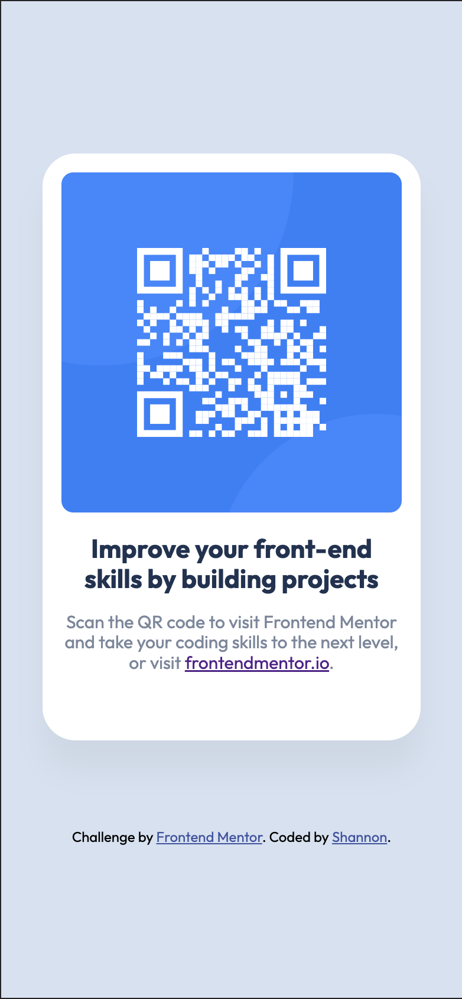

# Frontend Mentor - QR code component solution

This is a solution to the [QR code component challenge on Frontend Mentor](https://www.frontendmentor.io/challenges/qr-code-component-iux_sIO_H). Frontend Mentor challenges help you improve your coding skills by building realistic projects.

## Table of contents

- [Overview](#overview)
  - [Screenshots](#screenshots)
  - [Links](#links)
- [My process](#my-process)
  - [Built with](#built-with)
  - [What I learned](#what-i-learned)
  - [Continued development](#continued-development)
  - [Useful resources](#useful-resources)
- [Author](#author)
- [Acknowledgments](#acknowledgments)

**Note: Delete this note and update the table of contents based on what sections you keep.**

## Overview

### Screenshots




### Links

- [Solution URL](https://www.frontendmentor.io/solutions/responsive-qr-code-site-using-flexbox-and-accessibility-patterns-hldtw8wZC9)
- [Live Site URL](https://smckinney1.github.io/Frontend-Mentor-QR-Code-Challenge/)

## My process

### Built with

- Semantic HTML5 markup
- CSS variables
- Flexbox
- Accessibility patterns

**Note: These are just examples. Delete this note and replace the list above with your own choices**

### What I learned

This served as a practice project for me, an opportunity to get back to basics after several years of experience working in front end, especially React.

Having a beginner mindset is highly beneficial even at mid and senior levels (and beyond). I was reminded to use a CSS reset to avoid browser styles conflicting with my own, and the footer gave me the chance to practice accessibility skills. "Shannon" is not an accessibile description, so by setting this markup, I provide screen readers with something more helpful.

```html
<footer class="attribution">
  <!-- Screen readers will use the text in this span instead of the link description that appears in the UI. -->
  <span id="shannon" hidden>Shannon's profile page</span>
  Challenge by <a href="https://www.frontendmentor.io?ref=challenge" target="_blank" rel="noopener">Frontend Mentor</a>.
  Coded by <a aria-describedby="shannon" href="https://www.frontendmentor.io/profile/smckinney1" target="_blank" rel="noopener">Shannon</a>.
</footer>
```


### Continued development

N/A. Simple practice project.

### Useful resources

- [The Surprising Truth About Pixels and Accessibility](https://www.joshwcomeau.com/css/surprising-truth-about-pixels-and-accessibility/) - Provides further reading for anyone interested on when to use em, rem, and px.

## Author

- Frontend Mentor - [@smckinney1](https://www.frontendmentor.io/profile/smckinney1)

## Acknowledgments

N/A